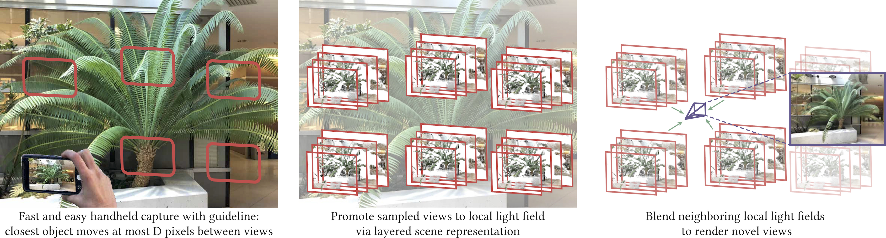

<br><br><br><br>

# Local Light Field Fusion
### [Project](https://fyusion.com/llff) | [Video](https://youtu.be/LY6MgDUzS3M) | [Paper](https://arxiv.org/) 

Tensorflow implementation for novel view synthesis from sparse input images.<br><br>
[Local Light Field Fusion: Practical View Synthesis 
with Prescriptive Sampling Guidelines](https://fyusion.com/llff)  
 [Ben Mildenhall](https://people.eecs.berkeley.edu/~bmild/)\*<sup>1</sup>, 
 [Pratul Srinivasan](https://people.eecs.berkeley.edu/~pratul/)\*<sup>1</sup>, 
 [Rodrigo Ortiz-Cayon](https://scholar.google.com/citations?user=yZMAlU4AAAAJ)<sup>2</sup>, 
 [Nima Khademi Kalantari](http://faculty.cs.tamu.edu/nimak/)<sup>3</sup>, 
 [Ravi Ramamoorthi](http://cseweb.ucsd.edu/~ravir/)<sup>4</sup>, 
 [Ren Ng](https://www2.eecs.berkeley.edu/Faculty/Homepages/yirenng.html)<sup>1</sup>, 
 [Abhishek Kar](https://abhishekkar.info/)<sup>2</sup>  
 <sup>1</sup>UC Berkeley, <sup>2</sup>Fyusion Inc, <sup>3</sup>Texas A&amp;M, <sup>4</sup>UC San Diego  
  \*denotes equal contribution  
  In SIGGRAPH 2019
  



## TL;DR

First install `docker` ([instructions](https://docs.docker.com/install/linux/docker-ce/ubuntu/)) and `nvidia-docker` ([instructions](https://github.com/NVIDIA/nvidia-docker)).

Run this in the base directory to download a pretrained checkpoint, build a Docker image, and run code to generate MPIs and a rendered output video on an example input dataset:
```
bash download_data.sh
cd docker
sudo docker build -t tf_colmap:latest .
cd ..
sudo nvidia-docker run --rm --volume /:/host --workdir /host$PWD tf_colmap bash demo.sh
```
A video like this should be output to `data/testscene/outputs/test_vid.mp4`:  
</br>


## Getting Started
### Installation

You can either install the prerequisites by hand or use our provided Dockerfile to make a docker image.

In either case, start by downloading this repository, then running the `download_data.sh` script to download a pretrained model and example input dataset:
```
git clone https://github.com/bmild/llff
cd llff
bash download_data.sh
```

#### Manual installation

- Install CUDA, Tensorflow, COLMAP
- Install the required Python packages
```
pip install -r requirements.txt
```
- Optional: make the CUDA renderer (uses `nvcc` from the CUDA install)
```
cd cuda_renderer
make
cd ..
```
- Optional: Install GLFW and make the OpenGL viewer:
```
sudo apt-get install libglfw3-dev
cd opengl_viewer
make
cd ..
```


#### Docker
First, install `docker` ([instructions](https://docs.docker.com/install/linux/docker-ce/ubuntu/)) and `nvidia-docker` ([instructions](https://github.com/NVIDIA/nvidia-docker)).

The command
```
sudo docker build -t tf_colmap:latest .
```
will build the docker image, which may take 15-30 mins. 

Afterwards, you can launch an interactive shell inside the container:
```
sudo nvidia-docker run -it --rm -p 9999:8888 --volume /:/host --workdir /host$PWD tf_colmap
```
This will allow you access to the code and data in this repo and map out port 8888 in case you want to launch a Jupyter server. 

To run a single command in the docker environment without entering a shell:
```
sudo nvidia-docker run --rm --volume /:/host --workdir /host$PWD tf_colmap <command...>
```


### Sanity check

You should now be able to run `bash demo.sh` from the command line in the base directory to generate an output video. If using the docker install, make sure you have launched the docker shell first. 

This should generate the video shown in the TL;DR section, saved at `data/testscene/outputs/test_vid.mp4`.


## Using your own data for view synthesis


Our method takes in a set of images of a static scene, upgrades the images to local light field representations (MPIs), and blends these local light fields to render novel views. Please see our paper for more details. 

As a rule of thumb, you should use images where the maximum disparity between views is no more than about 64 pixels (watch the closest thing to the camera and don't let it move more than ~1/8 the horizontal field of view between images). Our datasets usually consist of 20-30 images captured handheld in a rough grid pattern.

Begin by creating a base scene directory (e.g., `scenedir/`), and copying your images into a subdirectory called `images/` (e.g., `scenedir/images`).

### 1. Recover camera poses

This script calls COLMAP to run structure from motion to get 6-DoF camera poses and near/far depth bounds for the scene.
```
python imgs2poses.py scenedir
```

### 2. Generate MPIs

This script uses our pretrained Tensorflow graph (make sure it exists in `checkpoints/papermodel`) to generate MPIs from the posed images.
```
python imgs2mpis.py scenedir mpidir \
    [--checkpoint CHECKPOINT] \
    [--factor FACTOR] [--width WIDTH] [--height HEIGHT] [--numplanes NUMPLANES] \
    [--disps] [--psvs] 
```
You can set at most one of `factor`, `width`, or `height` to determine the output MPI resolution (factor will scale the input image size down an integer factor, eg. 2, 4, 8, and height/width directly scale the input images to have the specified height or width). 
Example usage:
```
python imgs2mpis.py scenedir scenedir/mpis --height 360
```

### 3. Render novel views

You can either generate a list of novel view camera poses and render out a video, or you can load the saved MPIs in our interactive OpenGL viewer.

#### Save rendered video
First, generate a smooth new view path by calling
```
python imgs2renderpath.py scenedir posefile \
	[--x_axis] [--y_axis] [--z_axis] [--circle][--spiral]
```
The five optional arguments specify the trajectory of the camera. The xyz-axis options are straight lines along each camera axis respectively, "circle" is a circle in the camera plane, and "spiral" is a circle combined with movement along the z-axis.  
Example usage:
```
imgs2renderpath.py scenedir scenedir/spiral_path.txt --spiral
```
See `llff/math/pose_math.py` for the code that generates these paths.

##### Render video with CUDA
You can build this in the `cuda_renderer/` directory by calling `make`.

Uses CUDA to render out a video. Specify the height of the output video in pixels (-1 for same as MPI), what factor to crop the edges of the video (default 1., no cropping), and the compression quality (CRF) for the saved MP4 file (default 18, lossless is 0, reasonable is 12-28).
```
./cuda_renderer mpidir posefile videofile height crop crf
```
Example usage:
```
./cuda_renderer scenedir/mpis scenedir/spiral_path.txt scenedir/spiral_render.mp4 -1 0.8 18
```


##### Render video with Tensorflow
Much slower (100-1000x) than CUDA renderer. Use Tensorflow to render out a video. Optionally, specify how many MPIs are blended for each rendered output (default 5) and what factor to crop the edges of the video (default 1., no cropping).
```
python mpis2video.py mpidir posefile videofile [--use_N USE_N] [--crop_factor CROP_FACTOR]
```
Example usage:
```
python mpis2video.py scenedir/mpis scenedir/spiral_path.txt scenedir/spiral_render.mp4 --crop_factor 0.8
```


#### Interactive OpenGL viewer


You can build this in the `opengl_viewer/` directory by calling `make` (you need GLFW installed).  

General usage is 
```
./opengl_viewer mpidir
```
Controls:
- Move mouse to translate in camera plane
- Click and drag to rotate camera
- Scroll to change focal length (zoom)
- 'L' to animate circle render path
- ESC to quit


## Citation

If you find this useful for your research, please cite the following paper.

```
@article{mildenhall2019llff,
  title={Local light field fusion: Practical view synthesis with prescriptive sampling guidelines},
  author={Ben Mildenhall and Pratul P. Srinivasan and Rodrigo Ortiz-Cayon and Nima Khademi Kalantari and Ravi Ramamoorthi and Ren Ng and Abhishek Kar},
  journal={ACM Transactions on Graphics (TOG)},
  volume={38},
  number={4},
  year={2019},
  publisher={ACM}
}
```
